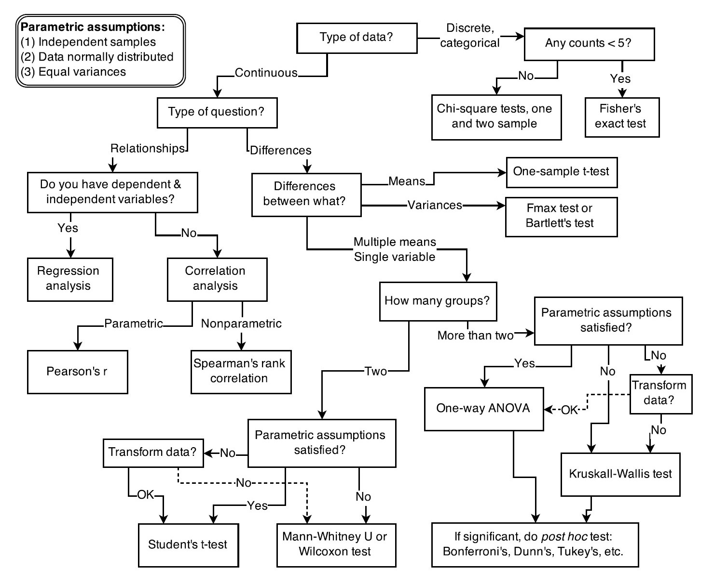

# Statistical Rethinking Chapter 1 Notes

- [Statistical Rethinking Chapter 1](#statistical-rethinking-chapter-1)
  - [1.1 The Golem of Prague](#11-the-golem-of-prague)
  - [1.2 Statistical Rethinking](#12-statistical-rethinking)
  - [1.3 Tools for golem engineering](#13-tools-for-golem-engineering)
    - [1.3.1 Bayesian data analysis](#131-bayesian-data-analysis)
      - [Bayes](#bayes)
      - [Frequentist](#frequentist)
      - [Bayesian Advantages](#bayesian-advantages)
      - [Rethinking](#rethinking)
    - [1.3.2 Model comparison and prediction](#132-model-comparison-and-prediction)
    - [1.3.3. Multilevel models](#133-multilevel-models)
    - [1.3.4. Graphical causal models](#134-graphical-causal-models)

## 1.1 The Golem of Prague

1. Scientists also make golems: scientific models. They have real effects on the world, through the **predictions** they make and the **intuitions** they **challenge** or **inspire**. 
2. Scientific models are neither true nor false, neither prophets nor charlatans. They are constructs engineered for some purpose.
3. These constructs are incredibly powerful, dutifully conducting their programmed calculations.
4. Sometimes their unyielding logic reveals implications previously hidden to their designers. 
5. The golems of science are wisely regarded with both awe and apprehension. We absolutely have to use them, but doing so always entails some risk.
6. The golem is a prosthesis, doing the measuring for us, performing impressive calculations, finding patterns where none are obvious. However, **there is no wisdom in the golem.** It doesn’t discern when the **context** is inappropriate for its answers. It just knows its own **procedure**, nothing else. 
7. Statistics is like engineering, a common set of design principles and constraints produces a great diversity of specialized applications.
8. Instead of a single method for building, refining, and critiquing statistical models, students are offered pre-constructed golems known as “tests” in introductory statistics courses. Each test has a particular purpose. So students and many scientists tend to use charts without much thought to their **underlying structure**, without much awareness of the **models** that each procedure embodies, and without any **framework** to help them make the inevitable **compromises** required by real research. 

9. Some may be useful enough, but serious trouble begins when scholars move on to conducting innovative research, pushing the boundaries of their specialties.
10. The classical procedures of introductory statistics tend to be inflexible (to adapt to contexts) and fragile (because they may fail in unpredictable ways in new contexts). The point is that classical tools are not diverse enough to handle many common research questions.
11. Statistical golems do not understand cause and effect. Every major branch of statistical philosophy possesses a unified theory, but they are not often taught. Hence there are benefits in rethinking statistical inference as a set of strategies, instead of a set of pre-made tools.
12. We need some statistical epistemology, an appreciation of how statistical models relate to hypotheses and the natural mechanisms of interest.

## 1.2 Statistical Rethinking
1. deductive falsification is impossible in nearly every scientific context:
    * **Hypotheses are not models.** The relations among hypotheses and different kinds of models are complex. Many models correspond to the same hypothesis, and many hypotheses correspond to a single model. This makes strict falsification impossible.
        - Hypotheses do not imply unique models, and models do not imply unique hypotheses. 
        - If you have multiple process models, a lot can be done. If it turns out that all of the process models of interest make very similar predictions, then you know to search for a **different description of the evidence**, a description under which the processes look different. We can also **compare** the **different predictions** produced by many models.
2. **Measurement matters.** Even when we think the data falsify a model, another observer will debate our methods and measures. They don’t trust the data. Sometimes they are right.
3. Statistical models can be confused in other ways as well, such as the confusion caused by **unobserved variables** (confounding variables) and **sampling bias**. Process models allow us to design statistical models with these problems in mind. The statistical model alone is **not enough**.
4. Seeking disconfirming evidence is important, but if we can believe that important scientific hypotheses can be stated as falsifiable, then we have a powerful method for improving the accuracy of our theories: look for evidence that disconfirms our hypotheses. 
5. Most of the problems scientists confront are not so logically discrete. 
   1. First, observations are prone to error, especially at the boundaries of scientific knowledge (*Observation Error*). At the edges of scientific knowledge, the ability to **measure** a hypothetical phenomenon is often in question as much as the phenomenon itself. Not all questions have a black-or-white answer. 
   2. Second, most hypotheses are quantitative, concerning degrees of existence, rather than discrete, concerning total presence or absence. (*Continuous Hypotheses*: It isn’t easy to disprove. The comparison must be probabilistic in many cases!) The probabilistic nature of evidence rarely appears when practicing scientists discuss the philosophy and practice of falsification. These sorts of measurement problems are the **norm**, not the exception.
6. **Falsification is consensual not logical.**

My thoughts: In the tradition of Continental Philosophy, Phenomenologists have argued that objectivity in Science were no more than consensus among a group of people i.e. people who held subjective beliefs. It is very interesting to see someone finally brought this up in a Statistics textbook. In one of the introductory book *PHENOMENOLOGY* by DAN ZAHAVI, he presented three different common stances scientists take. I will present them hear and argue why the following discussion can deepen the discussion above:

> Scientific reductionism is motivated by various methodological principles, including the one known as *Ockham’s razor*: Do not assume the existence of more types of objects (or ontological realms) than is strictly necessary. If we are to choose between several theories, each of which treats its own (apparently) irreducible part of reality, and a single theory, which in a systematic fashion can explain different parts of reality by reducing the more complex parts to less complex parts, we should choose the latter.

> The *eliminativist* shares many of the same concerns as the *reductionist*. Only that which can be accounted for using the methods and principles of the natural sciences count as real. ...our belief
that there exists something like “desire, fear, sensation, joy, pain, and so on” is nothing but theoretical assumptions that together constitute a primitive psychological theory. This primitive theory does not live up to the standards of contemporary science, it is not a credible psychological theory, and it therefore has to be rejected, just as one in the past has rejected, say, alchemy and phrenology.

> *Scientific naturalism* is distinguished by methodological as well as ontological commitments. The methodological commitment amounts to the idea that the correct procedures and the right types of justification are those found in and employed by the natural sciences. All genuine questions are natural scientific questions, and all genuine knowledge is objective knowledge gained by natural scientific means. (Galileo is one of those who held this type of belief.)

The reductionist/eliminativists certainly put most of the human science areas into question and cannot really explain how we can reduce/eliminate the Civic War in the US into natural science disciplines. We may even conclude that the war doesn't exist!

Instead of "defining objective reality as what is there *in itself*," or "distinguishing how things are for us from how they are *simpliciter* in order then to insist that the investigation of the latter is the truly important one," the author argued, "we should face up to the fact that objectivity is an accomplishment that involves both subjectivity and intersubjectivity ... Objectivity is the outcome of an intersubjective process. It is what we can agree upon at the end of inquiry." This argument precisely supports the argument about why logical falsification seemed absurd in real practice.

I will end with DAN ZAHAVI's explanation about what science is to give an overview about science from the Phenomenology perspective. This is a radical attitude towards science (but already existed for a long time):

> Science often presents itself as an attempt to describe reality objectively, i.e., from a third-person perspective. The search for objectivity is, of course, laudable, but we shouldn’t forget that any objectivity, any explanation, understanding, and theoretical modelling, presupposes the first-person perspective as its precondition. To that extent, the idea that science can deliver an absolute account of reality, one that is liberated from every theoretical and experiential perspective, is an illusion. Science is a distinct relation to the world, a particular theoretical modification of the natural attitude. This theoretical attitude did not fall down from the sky but has its own presuppositions and genesis. It is a tradition, a cultural formation. It is knowledge that is shared by a community of experiencing subjects and which presupposes a triangulation of points of view or perspectives. This is also why the usual opposition of first-person vs. third-person accounts is misleading. It makes us forget that third-person scientific accounts are accomplished and generated by a community of conscious subjects. There is no pure third-person perspective, just as there is no view from nowhere. This is, of course, not to say that there is no third-person perspective, but merely that such a perspective is, precisely, a perspective from somewhere. It is a view that we can adopt on the world. Science has its roots in the life world, it draws on insights from the prescientific sphere, and is performed by embodied and embedded subjects. If we wish to comprehend the performance and limits of science, we must investigate the forms of intentionality that are employed by the cognizing subjects.

We may be able to go back to this chapter later in Statistical Rethinking.

## 1.3 Tools for golem engineering

We want to use our models for several distinct purposes: designing inquiry, extracting information from data, and making predictions. In this book I’ve chosen to focus on tools to help with each purpose. These tools are:
(1) Bayesian data analysis 
(2) Model comparison 
(3) Multilevel models
(4) Graphical causal models

### 1.3.1 Bayesian data analysis

#### Bayes

1. Bayesian data analysis takes a question in the form of a **model** and uses **logic** to produce an answer in the form of **probability distributions**.

2. In modest terms, Bayesian data analysis is no more than **counting the numbers of ways the data could happen**, according to our assumptions. Things that can happen more ways are more **plausible** ... This allows us to use probability theory as **a general way to represent plausibility**, whether in reference to countable events in the world or rather theoretical constructs like parameters.

#### Frequentist

3. The frequentist approach requires that all probabilities be defined by **connection to the frequencies of events in very large samples**.This leads to frequentist uncertainty being premised on **imaginary resampling** of data—if we were to repeat the measurement many times, we would end up collecting a list of values that will have some pattern to it. It means also that parameters and models cannot have probability distributions, **only measurements can**. The distribution of these measurements is called a *sampling distribution*. This resampling is never done, and in general it doesn’t even make sense.
   
4. The sampling distribution of any measurement is **constant**, because the measurement is deterministic—there’s nothing “random” about it. 

#### Bayesian Advantages

5. Bayesian inference proceeds as usual, because the deterministic “noise” can still be modeled using probability, as long as we don’t identify probability with frequency. More generally, Bayesian golems treat “randomness” as **a property of information**, not of the world. 
   
6. Bayesian data analysis is just a **logical** **procedure** for processing information. However, **no** statistical approach, Bayesian or otherwise, is by itself **sufficient**.

7. Bayesian models lead to more intuitive interpretations, the ones scientists tend to project onto statistical results.

#### Rethinking

8. **Probability is not unitary** Essential and routine concepts' meanings depend upon **context** and analyst, upon **beliefs** about how well abstraction represents reality. Mathematics doesn’t access the real world directly. 

### 1.3.2 Model comparison and prediction

1. We’ll look at two related tools, neither of which knows the future: *cross-validation* and *information criteria*. These tools aim to compare models based upon **expected predictive accuracy**.
   
2. *Fitting is easy; prediction is hard.*
   
3. Why these methods?
   1. Provide useful expectations of predictive accuracy;
   2. Give an estimate of the tendency of a model to overfit, help to understand how models and data interact and to design better models;
   3. Spot highly influential observations.

### 1.3.3. Multilevel models

1. Any particular parameter can be usefully regarded as a placeholder for a missing model. Given some model of how the parameter gets its value, it is simple enough to embed the new model inside the old one. This results in a model with multiple levels of uncertainty, each feeding into the next—a *multilevel model*.
   
2. Helps us deal with **overfitting**. It exploits *partial pooling* that pools information across units in the data in order to produce better estimates for all units. Examples:
   1. To adjust estimates for repeat sampling;
   2. To adjust estimates for imbalance in sampling;
   3. To study variation;
   4. To avoid averaging.
All four apply to contexts in which the researcher recognizes clusters or groups of measurements that may differ from one another. 

3. Also used in: models for missing data (imputation), measurement error, factor analysis, some time series models, types of spatial and network regression, and phylogenetic regressions, paired t-test ...

4. *Multilevel regression deserves to be the default form of regression.*
5. Fitting and interpreting multilevel models can be considerably harder than fitting and interpreting a traditional regression model.

### 1.3.4. Graphical causal models

1. Facts outside the data are needed to decide which explanation is correct.

2. *Identification* problem: Models that are **causally incorrect** can make **better predictions** than those that are causally correct. As a result, focusing on prediction can systematically mislead us. Successful prediction does not require correct causal identification. We also need an accurate causal understanding. But comparing models on the basis of predictive accuracy—or *p*-values or
anything else—will not necessarily produce it. 

3. The simplest graphical causal model is a *directed acyclic graph*, usually called a DAG. DAGs are **heuristic**—they are not detailed statistical models. But they allow us to **deduce** which statistical models can provide valid causal inferences, assuming the DAG is true.
   
4. But where does a DAG itself come from? The terrible truth about statistical inference is that its validity relies upon information outside the data. We’re just going to have to keep doing science.

